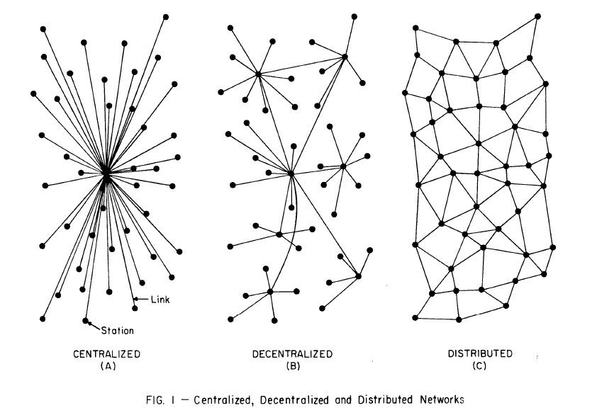

# 읽자마자 IT 전문가가 되는 네트워크

# 1주차 스터디

- 1주차 목차
    
    1장 네트워크는 어떻게 인터넷이 될까?
    
    노드와 네트워크
    
    서버와 클라이언트
    
    네트워크의 유형
    
    - 중앙집중식 네트워크
    - 비집중식 네트워크
    - 분산 네트워크
    
    하드웨어 주소
    
    - MAC 주소
    - 임의 MAC 주소
    
    기기가 네트워크에 연결되는 방법
    
    - 라우터에 신호 보내기
    - 연결하기
    
    2장 인터넷에서 정보는 어떤 모습일까?
    
    패킷이란?
    
    패킷은 무엇으로 구성될까?
    
    패킷 전송
    

# 네트워크의 유형

인터넷은 완벽하게 똑같은 형태로 분산되어있는 네트워크가 아니다.

수많은 센터가 있어서 중심이 나뉘어 있고, 각 센터는 서로 직간접적으로 연결되어있음 

그 센터를 우리는 노드라고부름.

# 노드와 네트워크

노드는 정보를 주고받을수있는 모든 네트워크 위에있는 기기들

예) 개인 노트북, 스마트폰 , 웹사이트를 구축한 서버 등등  정보를 주고받을 수있고 네트워크 통신을 하는  개체들은 노드라고 부를수있다.

정리하자면  네트워크에 연결된 하드웨어들을 노드라고하고 이 노드들은 모두 주소를 가지고있음.

네트워크들 연결할때

중간 노드가 되는것은  **라우터** 

라우터는 IP패킷들(트래픽을 구성하는 데이터 조각들)을
다른 네트워크로 옮기는 역할을함.

# 서버 와 클라이언트

앞에서 네트워크를 통해 서비스를 제공하는 노드는 “서버”

그 서비스를 사용하는 네트워크 노드는 “클라이언트”

# 하드웨어 주소

전자통신 을 하는 하드웨어들은 네트워크 카드라는걸 가지고있음.

그 네트워크 카드로 통신을 하는것

근데 그 카드에 **`MAC` 주소 라는 것이 있기떄문에**

물리적으로 식별할수있음.

# 라우터에 신호 보내기

네트워크 통신을하려면
MAC주소 이외에도  네트워크 주소가 추가로 필요함.

그 네트워크 주소를 얻으려면 라우터에 신호를 보내서 확인가능

그행위가

유선적으로는 이더넷 랜선을 물리적으로 연결하는것이고

무선적으로는 와이파이 네트워크를 선택해 비밀번호를 입력하게되면
`DHCP` ( 동적 호스트 구성 프로토콜) 을 통해 네트워크 카드에 따로 할당됌.

이요청에 성공하면
라우터는  네트워크 주소를 기기에 보내주는일 , 로컬 네트워크의 표준 게이트웨이를 통해

기기에 신호를 보내서 네트워크로 전송할 데이터를 요구하는 일 을 할수있다.

즉 이과정에 거치면 로컬 네트워크의 표준 게이트웨이를 통해서 인터넷에 연결이 됌

# 패킷이란?

인터넷에서 두 노드들이 통신할때 데이터들은 그대로 교환되지않고

`패킷` 이라는 형태로 교환됨

패킷은 크게  ‘발송 정보’ 외  ‘콘탠츠’ 로 이루어진 데이터 단위.

긱 패킷엔 주소 태그가 지정되며  주소태그는 패킷 헤더에 쓰여있음.

1번 ‘중앙집중 네트워크(centralized network)’에는 중심이 딱 한 개 있다.

장점:  결정 제어가 중앙에서만 집중되므로 네트워크 관리 간소화 , 리소스 할당을 효율적으로 가능함

단점: 중앙노드에서 이슈 발생시 전체 노드 가 문제가 생김 , 확장성의 문제.. 병목 현상이 발생하여 성능이 제한 될수있음.

2번 ‘탈중심 네트워크(decentralized network)’에는 유일한 중심이 존재하지 않는다. 대신, 여러 개의 중심이 존재한다.

장점: 확장성이 좋다 . 새로운 노드를 추가해도 과부하가 발생하지않음 , 대규모 조직에 유용함 다야안 노드들이 반독립적으로 작동할수있음

단점: 관리가 복잡하다. 단일제어지점이 없어서 , 중복이되고 비효율적일수도있다.

3번 ‘분산 네트워크(distributed network)’에는 단 한 개의 중심도 존재하지 않는다.

장점: **높은 복원력**: 분산 네트워크는 네트워크를 손상시킬 수 있는 중앙 지점이 없기 때문에 노드 오류에 대한 복원력이 뛰어납니다. , **로드 밸런싱**: 워크로드와 작업이 여러 노드에 분산되어 단일 노드에서 병목 현상이 발생하는 것을 방지합니다.

**단점:  각 노드마다 보안 관리를 해줘야할수도있다.**

# 추가 공부

# 프로토콜 (Protocol)

두 사람이 정보를 주고받을 때는 언제, 어디서, 어떻게 정보를 주고받을 지 약속을 해야 한다. 하다못해 친구랑 쪽지를 주고받을 때도, 우리는 암묵적으로 다음과 같은 약속을 하고 있다.

이렇게 정보 통신에서도 마찬가지로 통신을 원할하게 잘이루어지기 위한 규약을 프로토콜이라고한다.

이러한 약속들이 잘 이뤄지기 위해선 규약이 필요한다. 

그것이바로 프로토콜 : HTTP, TCP/IP, FTP, SSH 등 다양한 종류가있다.

세부적인 내용은 추가적으로 공부 해봐야할것같다.

# **인터넷(Internet), 인트라넷(Intranet)**

인터넷과 인트라넷은 다르다.

인터넷과 인트라넷은 모두 TCP/IP 프로토콜을 활용하는 네트워크이며 각 노드에는 고유한 IP 주소가 할당됩니다. 그러나 범위와 접근성이 크게 다릅니다

**인터넷**:

- 전 세계 누구나 접속 가능한 글로벌 오픈 네트워크입니다.
- 인터넷에 접속하려면 개인이나 단체가 SKT, KT, LG U+ 등 인터넷 서비스 제공업체(ISP)를 통해 서비스에 가입해야 합니다.
- 인터넷은 광범위한 네트워크를 연결하여 광범위한 의사소통과 정보 공유를 가능하게 합니다.

**인트라넷**:

- 인트라넷은 일반적으로 단일 조직 내에서 사용되는 제한된 개인 네트워크입니다.
- 조직 내 특정 노드나 사용자에게만 제한된 '폐쇄형 인터넷'입니다.
- 인트라넷에 액세스하려면 해당 네트워크에 직접 연결해야 하며, 이는 일반적으로 보호되며 적절한 인증 없이는 외부 세계에서 액세스할 수 없습니다.

결론적으론 인터넷은 전세계 , 인트라넷은 특정 조직이나 그룹네에서만 사용가능한 네트워크